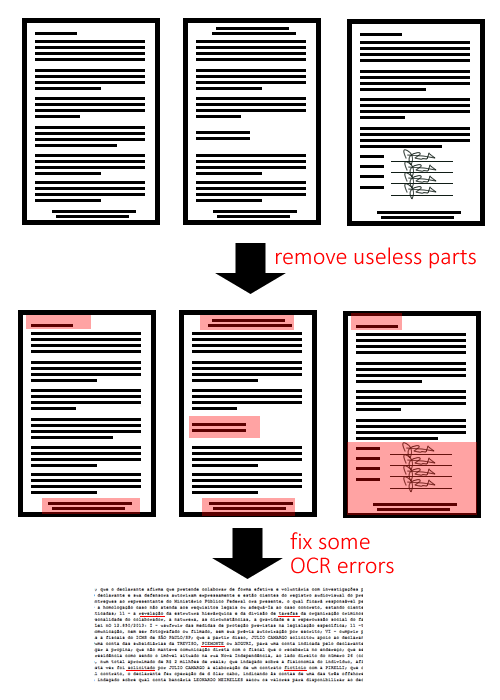
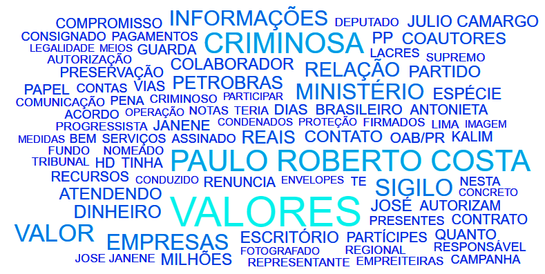

# Corruption scandal analysis
This is a project I've conceived to process and analyze all the published documents of a current investigation called Lava Jato, which is aimed towards a giant corruption scandal in Brazil, involving several politicians, enterpreneurs, and criminals of all sorts. Several of them were offered a chance to give away information about the scheme in exchange for making their prosecutions lighter. Most of the documents used in this project came from these interviews.  

The documents are in PDF format. They've been made filled electronically, printed, signed in hand, scanned, and put through OCR. And the only 'public' version is this post-OCR. I'ts better than what I expected for OCR documents, but worse than expected for information to be used in data science projects. So most of the challenge is getting the valuable parts of these documents, without all the noise created by OCR errors.

Apart from taking care of the OCR errors, I had to deal with removing "useless" parts of the PDFs. That is, parts that aren't really important to the process, and are only there due to being an official document.

Here's one wordcloud created with this code.

