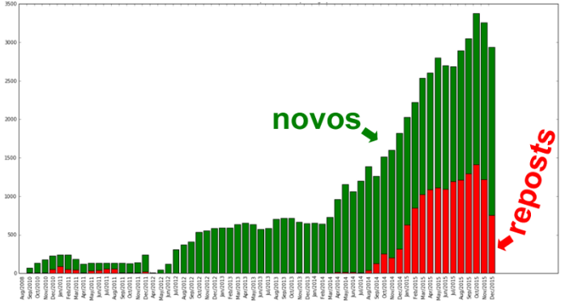

# Facebook Statistisc
This is a simple project to download and analyze all the posts from a Facebook page. 

There's this Facebook page that is wildly popular in Brazil (over 6 million likes, for a page about culture targeting young people? that's something). On the past year or so, the page has received several complaints (in the form of enraged comments) abouthow the page has changed, reposts a lot of stuff, and focuses on more polemic posts (such as sex-related ones).

I've downloaded all 610 thousand posts from this page (since its creation on 2010), and found some pretty accurate evidence that the page creators have started systematically reposting old posts recently, to the point that a single post was posted 91 times. Also, I've found that sex-related posts, that previously were a bit rare in the page, started becoming more and more present. Supposedly because they bring more clicks.

I've written a [post in Medium](https://medium.com/@marceloramires/catraca-livre-um-estudo-sobre-seus-posts-523523535152#.78m313xck) (in Portuguese) with my findings, and sent it to the founder of the page, Gilberto Dimenstein. He then answered my e-mail saying the criticism had really valid points, and forwarded it to the editors.

Here's the posting distribution of the most reposted item over time:

